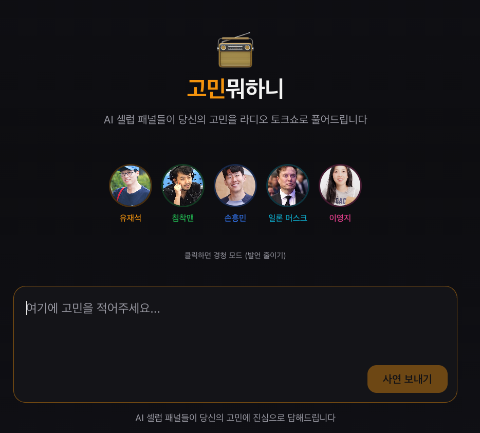
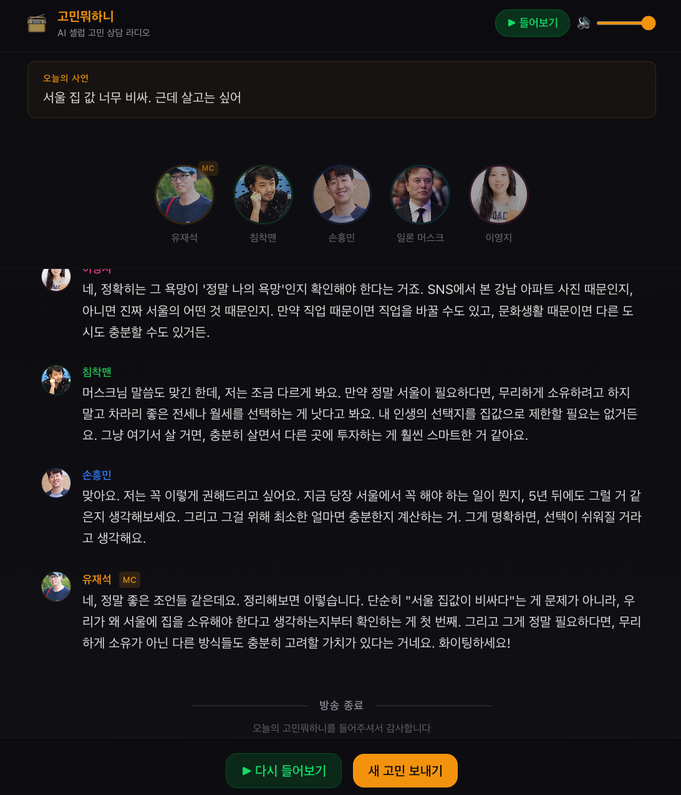

<div align="center">

# 📻 고민뭐하니

**AI 셀럽 패널 5명이 당신의 고민을 라디오 토크쇼로 상담해주는 웹앱**

유재석(MC) · 침착맨 · 손흥민 · 일론 머스크 · 이영지

[](https://hackerton-rokoon.vercel.app)

&nbsp;&nbsp;

</div>

## 주요 기능

- **실시간 스트리밍** — Claude API(SSE)로 대본 실시간 생성, 발언 단위 즉시 표시
- **ElevenLabs TTS** — 패널별 음성 매칭된 AI 보이스로 자동 재생
- **스튜디오 UI** — 패널 스포트라이트, 오디오 파형, 트랜스크립트
- **경청 모드** — 특정 패널 뮤트 (방송 중 실시간 반영)
- **볼륨 컨트롤** — 재생 중 음량 조절

## 기술 스택

| 영역 | 기술 |
|------|------|
| Frontend | Next.js, Framer Motion |
| AI 대본 | Anthropic Claude API (Haiku 4.5) |
| 음성 합성 | ElevenLabs TTS (Turbo v2.5) |
| 배포 | Vercel |

## 시작하기

```bash
pnpm install
cp .env.example .env  # API 키 설정
pnpm dev
```

필요한 API 키는 `.env.example` 참고.

## 라이선스

MIT
